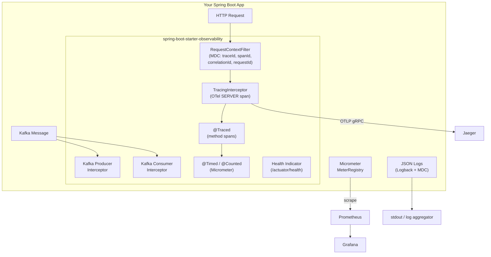

# Spring Boot Starter Observability

[](https://github.com/ayushwing/spring-boot-starter-observability/actions)
[](LICENSE)
[](https://openjdk.org/)
[](https://spring.io/projects/spring-boot)

A reusable Spring Boot starter that bundles **structured logging**, **distributed tracing** (OpenTelemetry), and **metrics** (Micrometer) into a single dependency. Drop it into any Spring Boot 3.x app and get production-grade observability out of the box — no boilerplate required.

## Why?

Every microservice needs observability, but wiring up structured logging, distributed tracing, and metrics from scratch is tedious and error-prone. Teams end up with inconsistent setups across services — different log formats, missing trace context, no correlation between logs and traces.

This starter solves that by providing a single, opinionated dependency that gives you:

- **Structured JSON logging** with `traceId`, `spanId`, `requestId`, and `correlationId` injected into every log line automatically
- **Distributed tracing** via OpenTelemetry with automatic span creation for HTTP requests and Kafka messages
- **Metrics** via Micrometer with JVM metrics out of the box and custom `@Timed` / `@Counted` annotation support
- **Correlation ID propagation** across service boundaries via `X-Correlation-Id` header
- **Graceful degradation** — the app starts cleanly even if Jaeger or the OTLP endpoint is unreachable
- **Kafka trace context propagation** using W3C `traceparent` headers

## Architecture



## Modules

| Module | Description |
|--------|-------------|
| `starter-core` | Shared constants and annotations (`@Traced`, `@Timed`, `@Counted`) |
| `starter-autoconfigure` | All Spring Boot auto-configuration (logging, tracing, metrics, health) |
| `starter-sample` | Sample CRUD API with full docker-compose stack (Jaeger + Prometheus + Grafana) |

## Quick Start

> **Note:** This library is under active development and not yet published to Maven Central. Build locally for now.

### 1. Build locally

```bash
git clone https://github.com/ayushwing/spring-boot-starter-observability.git
cd spring-boot-starter-observability
mvn clean install -DskipTests
```

### 2. Add the dependency

```xml
<dependency>
    <groupId>com.ayushwing</groupId>
    <artifactId>observability-starter-autoconfigure</artifactId>
    <version>0.1.0-SNAPSHOT</version>
</dependency>
<!-- Required transitive runtime deps -->
<dependency>
    <groupId>net.logstash.logback</groupId>
    <artifactId>logstash-logback-encoder</artifactId>
    <version>7.4</version>
</dependency>
```

### 3. Configure (all optional — sane defaults provided)

```yaml
observability:
  logging:
    format: json                        # "json" (default) or "text"
    include-headers: false              # add request headers to MDC
    header-filter: "X-Trace-Id,Accept" # whitelist of headers to include
    include-request-info: true          # add httpMethod + requestUri to MDC
    service-name: ${spring.application.name}
    custom-fields:
      environment: production
      region: us-east-1

  tracing:
    enabled: true
    endpoint: http://localhost:4317     # OTLP gRPC endpoint
    service-name: ${spring.application.name}
    sampling-ratio: 1.0                 # 0.0–1.0
    exporter-timeout-ms: 30000

  metrics:
    enabled: true
```

## Features

### Structured JSON Logging

Every log line emitted during an HTTP request automatically includes:

```json
{
  "timestamp": "2024-03-15T10:22:45.123Z",
  "level": "INFO",
  "logger": "com.example.OrderService",
  "message": "Order placed successfully",
  "traceId": "a3f1c2d4...",
  "spanId": "b7e8f9a0",
  "requestId": "550e8400-e29b-41d4-a716-446655440000",
  "correlationId": "7f3a1b2c-...",
  "httpMethod": "POST",
  "requestUri": "/api/orders",
  "service": "order-service"
}
```

### Distributed Tracing

HTTP spans are created automatically for every request. Use `@Traced` for custom method-level spans:

```java
@Traced("payment.charge")
public Receipt chargeCustomer(String customerId, BigDecimal amount) {
    // This method runs inside its own OpenTelemetry span
    // named "payment.charge" in Jaeger
}

// Exception details are automatically recorded on the span
@Traced(recordException = true)
public Inventory checkStock(String productId) { ... }
```

Kafka trace context propagates automatically via W3C `traceparent` headers — no code changes needed.

### Metrics with Custom Annotations

JVM metrics (memory, GC, threads, CPU) are registered automatically. Add per-method instrumentation with annotations:

```java
@Timed("orders.process.duration")
public Order processOrder(String orderId) {
    // Records execution time with tags: class, method, exception
}

@Counted("payments.initiated")
public void initiatePayment(Payment payment) {
    // Increments counter with tags: class, method, result (success/failure)
}
```

### Correlation ID Propagation

The `X-Correlation-Id` header is read on inbound requests (or generated if absent) and:
1. Stored in MDC as `correlationId` — appears in every log line
2. Returned in the response header
3. Should be forwarded in downstream HTTP calls for full cross-service traceability

### Health Check

When `spring-boot-actuator` is present, a dedicated health indicator is available:

```
GET /actuator/health/observability

{
  "status": "UP",
  "details": {
    "metrics": "UP",
    "tracing": "UP",
    "logging": "UP"
  }
}
```

## Running the Sample App

The `starter-sample` module contains a full product CRUD API wired up to the complete observability stack.

```bash
cd starter-sample
mvn package -DskipTests -pl .. -am
docker compose up -d
```

| Service | URL |
|---------|-----|
| Sample API | http://localhost:8080/api/products |
| Actuator Health | http://localhost:8080/actuator/health |
| Jaeger UI | http://localhost:16686 |
| Prometheus | http://localhost:9090 |
| Grafana | http://localhost:3000 (admin / admin) |

Try a few requests and watch traces appear in Jaeger:

```bash
# List products
curl http://localhost:8080/api/products

# Create a product
curl -X POST http://localhost:8080/api/products \
  -H "Content-Type: application/json" \
  -d '{"name":"Mechanical Keyboard","category":"electronics","price":149.99}'

# Check the correlation ID in the response header
curl -v http://localhost:8080/api/products 2>&1 | grep X-Correlation-Id
```

## Configuration Reference

### `observability.logging.*`

| Property | Default | Description |
|----------|---------|-------------|
| `format` | `json` | Log format: `json` or `text` |
| `include-headers` | `false` | Include request headers in MDC |
| `header-filter` | `""` | Comma-separated header whitelist (empty = all) |
| `include-mdc` | `true` | Include trace context in log output |
| `include-request-info` | `true` | Add `httpMethod` and `requestUri` to MDC |
| `service-name` | (spring.application.name) | Service name in log output |
| `custom-fields` | `{}` | Static MDC key-value pairs added to every log line |

### `observability.tracing.*`

| Property | Default | Description |
|----------|---------|-------------|
| `enabled` | `true` | Enable distributed tracing |
| `endpoint` | `http://localhost:4317` | OTLP gRPC exporter endpoint |
| `service-name` | (spring.application.name) | Service name in spans |
| `sampling-ratio` | `1.0` | Sampling ratio (0.0–1.0) |
| `exporter-timeout-ms` | `30000` | Flush timeout on shutdown (ms) |

### `observability.metrics.*`

| Property | Default | Description |
|----------|---------|-------------|
| `enabled` | `true` | Enable Micrometer metrics auto-configuration |

## Tech Stack

- Java 17+
- Spring Boot 3.2
- OpenTelemetry SDK 1.36
- Micrometer 1.12
- SLF4J + Logback + logstash-logback-encoder
- JUnit 5 + Testcontainers + Mockito

## Contributing

See [CONTRIBUTING.md](CONTRIBUTING.md). Issues and PRs welcome.

## License

[Apache License 2.0](LICENSE)
